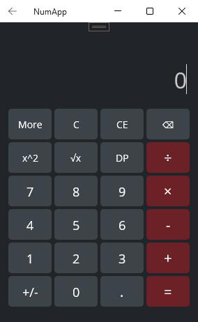
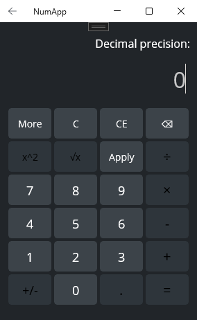
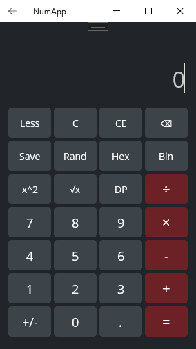
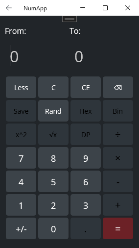

# **NumApp**

"NumApp" is a user-friendly calculator that allows to perform basic mathematical operations. It is also enriched with useful features not always present in similar applications.

## **Technical side of things**

The application is written with C# and XAML, using the .NET MAUI framework.

## **Features**

#### Basic operations

The calculator allows to perform all basic mathematical operations (addition, subtraction, multiplication, division). It also enables the user to change the sign of the current number, raise it to the power of 2, or get its square root. The operation window supports input from the app buttons as well as directly from the keyboard.

#### Decimal precision

The *DP* (decimal precision) button allows the user to set a custom range of decimal precision of the calculations.

#### Additional options

The *More* button enables access to additional options:

- *Save* allows to save all finished calculations to a locally stored JSON file.
- *Random* switches the calculator to a random generator mode which allows to get a random number within the desired range.

- *Hex* converts the current number to hexadecimal.
- *Bin* converts the current number to binary.

## **Main challenges**

When implementing the project I stumbled upon several challenges:

- _Direct keyboard input_. After some initial tests it turned out that users expect the option to type numbers and operations directly from keyboard and not only using the displayed buttons. Since MAUI (as far as I know) doesn't provide a way to detect which key has been pressed, I opted for intercepting the input indirectly by setting the focus on the entry and reading the characters entered.
- _Order of operations_. I needed to find a way to ensure the mathematical order of operations was preserved even when performing several operations in a row. To achieve that I decided to allow only one operation at a time, update the result immediately and use the updated value in the next operation.
- _Hex and binary conversion_. Converting a decimal value to hexadecimal or binary proved to be a little bit more complicated than I expected. The method I used was to divide the decimal value by 16 (for hexadecimal) or 2 (for binary), use the remainder to build the converted number (from the last to the first place) and repeat the process using the quotient of the division until reaching a value of 1 or less.
- _Writing data to JSON_. Even though I used a Microsoft tutorial for writing data to JSON, the saving feature required me to develop a flexible system of storing the calculations performed by the user. I had to account for unfinished calculations (not valid for saving) and possible deletion of data in the middle of a calculation. I did this by creating 2 lists of operations: one for the current calculation and another one for finished (valid for saving) calculations that get added across the application lifecycle.

## **Credits**

- Information on using the Newtonsoft.Json package from the [Microsoft tutorial](https://learn.microsoft.com/en-us/visualstudio/get-started/csharp/tutorial-console-part-2?view=vs-2022)
- Tips on conversion to hexadecimal from the [calculator.name page](https://calculator.name/baseconvert/decimal/hexadecimal/3225)
- Hint about getting rid of the underline in the MAUI entry from [StackOverflow](https://stackoverflow.com/questions/76098413/change-color-of-entry-underline-or-remove-this-color)
- Hint about setting the initial entry foucs from the [Microsoft forum](https://learn.microsoft.com/en-us/answers/questions/1167870/net-maui-how-to-run-method-after-page-is-shown)

